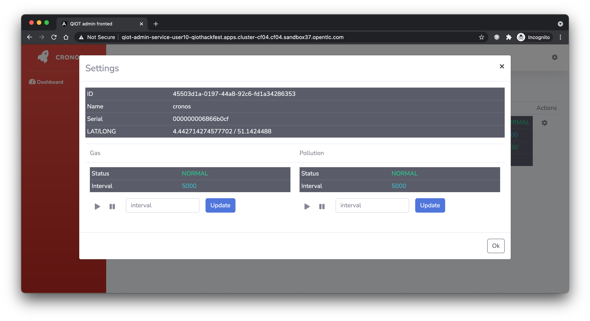

# Bill of materials

## Source code
- https://github.com/sipsoli/qiot-sensor-service-base
- https://github.com/sipsoli/qiot-sensor-service
- https://github.com/sipsoli/qiot-edge-service
- https://github.com/sipsoli/qiot-admin-service

## Public container images
- https://quay.io/repository/olivier_sips/qiot-sensor-service-base
- https://quay.io/repository/olivier_sips/qiot-sensor-service
- https://quay.io/repository/olivier_sips/qiot-edge-service
- https://quay.io/repository/olivier_sips/qiot-admin-service

# Fedora IoT Operating System

In the first part we created a pod network using Podman.  

## key descisions

- create pod container network
- manage images using systemctl
- auto-update images 

```shell script
podman pod create --name sensor -p 8080:8080
...
add sensor and edge service container images
...
podman generate systemd --new --files --name sensor
cp pod-sensor.service-* /etc/systemd/system
systemctl enable pod-sensor.service
systemctl start pod-sensor.service
podman auto-update 
```

# Sensor Service


Building qiot-admin-service-base and pushing to public image registry.
```shell script
docker buildx build -t quay.io/olivier_sips/qiot-sensor-service-base --platform=linux/arm64
```

Building qiot-sensor-service and pushing to public image registry.
```shell script
docker buildx build -t quay.io/olivier_sips/qiot-sensor-service-base --platform=linux/arm64
```

# Edge Service

## key decisions
1. registration service.

   The first and most important step is to register the measurement station with Datahub. 
   Since the registration step can only be executed once for a single serial, we opted to save the registration response to disk. 
   This ensures that the application can survive a restart. 
   It's important that this information is saved on the RPI and not inside the docker container. 
   This is why we mounted a persistent volume when starting the docker container.

2. localization service

   To easily distribute the edge-service on a global scale, we opted to use the nominatim service to translate a physic address to a lat/long.
   This was a walk in the park, Using the microprofile rest-client supported by quarkus.

3. sensor service 

   We ues a scheduler to collect the gas and pollution telemetry. 
   We opted to use two different schedulers to be able to manage both schedulers via a custom admin quarkus application deployed on openshift.
   Both schedulers are started with a different start delay to allow the measurements to be collected with minimal concurrent cpu usage.
   Thanks to the MqttClientProducer we implemented the mutual TLS Mqtt client to securelly transfer the data to Datahub.
   As an extra, we added a SensorHealthCheck which checks if collecting measurement from the sensor service is healthy.
   
4. statistics

   We expose station statistics which collect metrics about gas and pollution schedulers. 
   This data is exposed both to a rest endpoint as to a custom websocket, which'll be used to display information in the browser by the qiot-admin-service.
   
5. admin

   When the edge-service is started, it tries to connect to the qiot-admin-service application.
   This process is optional, when admin service is available, it starts a web-socket connection where information can flow in two ways.
   First, the edge-service transfers scheduler information towards the admin-service.
   The admin-service is also able to issue commands like pause, play and update interval of the schedulers.

5. context

   The qiot-sensor-service sends a x-correlation-id request header in each request. 
   The goal of the context handler was to catch this request header and add it the MDC fields of SLF4J in order to debug application metrics. 

5. multi arch builder
   
   Last important step, was supporting multi arch image builder using native compilation.
   We used the multi-arch builder provided in the drop-in-clinic to achive this goal.


Building qiot-edge-service and pushing to public image registry.
```shell script
docker build -f src/main/docker/Dockerfile.native-aarch64 -t quay.io/olivier_sips/qiot-edge-service:latest . && \
docker push quay.io/olivier_sips/qiot-edge-service:latest
```
# Admin Service

## Pausing, Resuming, Updating Intervals

We developed a custom qiot-admin-service running on openshift to issue commands towards the qiot-edge-service.
As you can see in the screenshots below, we are able to connect the the qiot-edge-service using websockets. 

Since websockets are persistent connections, we have a two way communication between the qiot-admin-service and the qiot-edge-service.
We can leverage this connection to issue commands like, pausing, resuming and updating interval of the schedulers.





Building qiot-admin-service and pushing to public image registry.
```shell script
mvn package -Pnative -Dquarkus.native.container-build=true && \
docker build -f src/main/docker/Dockerfile.native -t quay.io/olivier_sips/qiot-admin-service:latest . && \
docker push quay.io/olivier_sips/qiot-admin-service:latest
```

# grafana dashboard 

When qiot-sensor-service and qiot-edge-service are running in the pod network created by Podman and connected to production datahub services running on openshift, we can successfully see that measurment data is transmitted.


